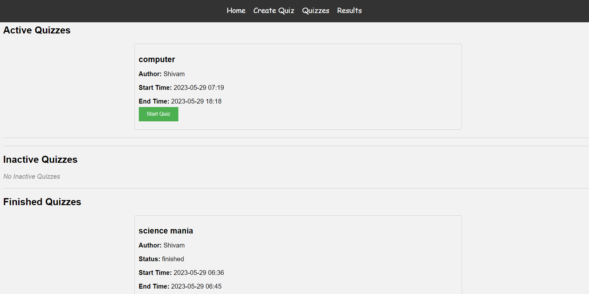

# QuizTime

QuizTime is a web-based quiz application built with Flask. It allows users to create quizzes, take quizzes, and view quiz results.

## Screenshots

### Home Page

### Create Quiz Page

### Quizzes Page

### Quiz Page

### Results Page

## Features

- **Home Page**: Users can access the home page where they can navigate to create quizzes or view existing quizzes.

- **Quizzes Page**: Users can see a list of quizzes categorized as active, inactive, and finished. They can select an active quiz to start.

- **Create Quiz Page**: Users can create a new quiz by providing quiz details, including the number of questions, options, and correct answers.

- **Quiz Page**: Users can take a quiz by selecting options for each question. The score is calculated and displayed upon submission.

- **Results Page**: Users can view the results of all quizzes, including the quiz ID, score, quiz name, and timestamp.

## Getting Started

To run the QuizTime project locally, follow these steps:

1. Clone the repository: `git clone https://github.com/your-username/quiztime.git`
2. Install the required dependencies: `pip install -r requirements.txt`
3. Set up the MongoDB connection by replacing the `uri` variable in `main.py` with your MongoDB URI.
4. Start the Flask development server: `python main.py`
5. Access the application in your web browser at `http://localhost:5000`

## License

This project is licensed under the [Creative Commons Zero v1.0 Universal](LICENSE).
